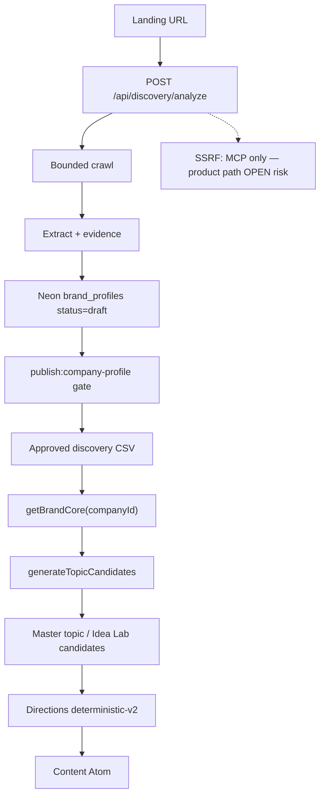

# MarketMonth Full-System Reality Audit — 2026-07-28

**Auditor role:** Reality Auditor / senior architect  
**Scope:** URL → crawl → brand → Brand Core → topic generation (sprint-lock gate)  
**Companion plan:** fixture-first sprint (cleanup, de-hardcode, one pipeline, provenance, dup brand, CSV contract)  
**Report status:** Post-sprint remediation included — findings mark **Fixed in sprint** vs **Open**

---

# 1. Executive verdict

## Primary gate: next development sprint

| Gate | Verdict | Confidence |
|------|---------|------------|
| **Continuing development (URL→topic sprint)** | **GO** (with explicit deferrals) | **78%** |
| Production release | **STOP** | **90%** |
| Agent readability | **GO** (Partial) | **70%** |
| Robust website collection | **REVISE** | **65%** |
| Relevant topic generation | **GO** (Partial → improved) | **72%** |
| Customer-site 2026 best-practice auditing | **STOP / Planned** | **85%** |

**Reasoning.** The critical product path is coherent enough to build the next Idea Lab / six-ideas stage: a non-supplement fixture (ClearFlow Plumbing) parses → Brand Core → `generateTopicCandidates` with **0 industry leaks**, discovery content-opportunity templates are industry-agnostic, product automatic master topics now call `generateTopicCandidates`, Brand Core resolves more than `zynava.com`, trailing-slash duplicate brands are healed on write, and CSV overrides emit superseding evidence. Production remains blocked by missing product-path SSRF, incomplete auth hardening, mocked review/publish surfaces, and no app-level discovery e2e.

**Strongest verified capability.** Bounded discovery crawl + evidence-grounded brand profile materialization into an approved CSV that Brand Core compiles into a typed runtime SoT. **Verified** via code + ClearFlow fixture harness + Neon read-only inspection (pre-sprint).

**Largest verified weakness (pre-sprint; largely mitigated).** Supplement-shaped hardcodes closed a loop: `contentOpportunitiesForCatalog` wrote “price per serving / supplement labels” into CSV → subjects → topics. **Fixed in sprint** for catalog opportunities + measured brain path. Residual vitamin/ingredient mine regexes remain in catalog extractors (fire on matching titles only).

**Largest unknown.** Whether a second *live* customer (not a synthetic CSV) survives crawl → gate → publish → topics without manual overrides. **Not verified** end-to-end against a non-Zynava public site in this audit (DB-writing scripts deferred).

**Cheapest useful next test.** Analyze one real non-supplement SMB site through `POST /api/discovery/analyze` (read drafts only), materialize a proposed CSV without publishing, run the industry-agnostic harness against that CSV.

---

# 2. Evidence ledger

## Verified facts

- Journey: landing → `POST /api/discovery/analyze` → crawl/extract → Neon `draft` brand_profiles; Brain product path reads **approved CSV** via `getBrandCore`, not live Neon drafts. **Verified** (code + CURRENT_STATE).
- `assertPublicHttpUrl` exists in `mcp/src/security/url-policy.ts` and is **not** called from `/api/discovery/analyze`. **Verified** (grep).
- Pre-sprint: product Marketing Topic used template `buildAutomaticMaster`; Idea Lab used `generateTopicCandidates`. **Verified** → **Fixed**: automatic path delegates to `buildAutomaticMasterFromCandidates` → `generateTopicCandidates`.
- ClearFlow fixture: `totalLeaks=0`, `discoveryLeaks=[]` after template rewrite (`data/fixtures/industry-agnostic-measurement.json`). **Verified** (node:test 2026-07-28).
- Neon (read-only, pre-sprint): host marker `marketmonth-dev`, schema v4; published pointer `45488b6e`; duplicate brands `https://zynava.com` vs `https://zynava.com/`. **Verified** (live SQL).
- Cleanup: 14 tracked `.bak-*` removed (commit `89816f5`); 8 tracked orphans + bak-stop + gitignore (commit `4eb59f5`); 11 untracked bak + 6 untracked orphan scripts deleted from disk. **Verified** (git + filesystem).
- Sprint unit suites: 19/19 pass for industry-agnostic, normalize-url, discovery-csv-rows, get-brand-core, extract-catalog-names. **Verified**.

## Supplied facts

- User locked: adopt `generateTopicCandidates` on product path; delete all three cleanup groups; fixture-first sequence; no DB-writing seed/publish during audit.

## Inferences

- Epoch `retrieved_at` in CSV is intentional for artifact hash stability (`materializeCsvForHash`).
- `company_publications.completed_at` preceding `created_at` is a clock/ordering quirk, not a publish-logic failure (observed, not re-proven after sprint).

## Assumptions

- Approved Zynava CSV remains the primary demo SoT until a second company is published.
- Ranked-candidate UI may remain Idea Lab–only even though the product generator is unified.

## Unknowns

- Live non-Zynava crawl → publish → topics quality.
- Full `npm test` / `knowledge:check` / `mcp:doctor` suite after this sprint’s uncommitted working tree (only targeted suites run).
- Whether historical Neon duplicate brand rows heal on next analyze without manual SQL.

## Blocked checks

- No DB-writing scripts (`seed:*`, `publish:*`, e2e neon) during audit per plan constraint.
- No production auth/SSO exercise.
- Website best-practice auditor feature remains doctrine/Partial — not a live gate.

---

# 3. Current architecture

## Top-level inventory

| Path | Role |
|------|------|
| `src/app/` | Next.js App Router UI + API routes |
| `src/engine/discovery/` | Crawl, extract, evidence, activation, persist, publish |
| `src/brain/` | Brand Core, topic candidates, directions, Idea Lab use-cases |
| `src/lib/` | UI-safe discovery stages, CSV helpers, auth, ask retrieval |
| `src/db/` | Drizzle schema + migrations + DB safety markers |
| `mcp/` | Read-only Discovery MCP (`mm_*`) |
| `project-knowledge/` | Product doctrine SoT |
| `agent-prompt-system/` | APS workflows (Cursor agents, not runtime) |
| `data/fixtures/` | Approved / proposed discovery CSVs |
| `docs/ai/` | Engineering audits and toolchain docs |
| `reference-library/` | Noncanonical — ignore for product truth |

## Component responsibilities

1. **Discovery engine** — fetch pages, extract brand/catalog/FAQ/SEO signals, build evidence + activation profile, persist drafts.
2. **Publish path** — draft → overrides → acceptance gate → immutable published → materialize approved CSV.
3. **Brand Core** — compile CSV (+ evidence) into typed runtime brand context for Brain.
4. **Topic generation** — subjects → seeds → ranked candidates (`generateTopicCandidates`).
5. **Directions / Atom** — selected master → six directions → channel specialists (YouTube Short Live-ish; others scaffolds).

## Major dependencies

Next.js, Drizzle/Neon, Auth.js, OpenAI (optional), Playwright (extras), Zod, APS/Cursor tooling.

## Mermaid — URL → topic (post-sprint)



## Intentional boundaries (preserve)

- Discovery UI must not import `src/engine/discovery/` — use `src/lib/discovery/stages.ts`.
- Approved CSV is a **materialized view of gated DB state**, not a DB enrichment input (except controlled seed/diag scripts).
- APS ≠ product prompts; MCP is read-only for knowledge.
- Thin `X.ts` + `X/` orchestrator pairs are intentional.
- Three doc registries (docs-index, MCP PROJECT_DOCS, Ask SEED_DOCS) are separate security boundaries (`nav-drift` smoke).

---

# 4. Critical customer journey

| # | Stage | Status | Notes |
|---|-------|--------|-------|
| 1 | Landing URL entry | Prototype | Public landing + discovery card |
| 2 | `POST /api/discovery/analyze` | Partial / Live | NDJSON stream; **no SSRF** |
| 3 | Crawl (≤10 pages / 24 attempts) | Partial | robots/sitemap incomplete; Playwright extras |
| 4 | Extract brand / catalog / FAQ | Partial | Main-content clean; vitamin mine regex residual |
| 5 | Evidence + activation profile | Partial | Grounded activation Hook |
| 6 | Neon draft persist | Partial | **Fixed**: slash-normalized brand upsert + draft reuse by knowledgeHash |
| 7 | Human / publish gate | Partial | Scripted publish; no Dev UI button |
| 8 | Approved CSV SoT | Partial | Clean-slate materialize |
| 9 | `getBrandCore` | Partial → improved | **Fixed**: multi-company fixture adapters / path convention |
| 10 | Topic candidates | Partial → improved | **Fixed**: single generator on product automatic path |
| 11 | Master topic provenance | Partial → improved | **Fixed**: candidate `evidenceIds` + derived confidence |
| 12 | Directions | Partial | deterministic-v2 + optional hook enrichment |
| 13 | Content Atom / channels | Partial / Mocked | YouTube Short path; others not_connected |
| 14 | Review / calendar / analytics | Mocked | UI shells |
| 15 | Multi-tenant workspace | Mocked / Planned | |
| 16 | Auth gates | Partial | Google scaffold; not all surfaces hardened |
| 17 | Idea Lab (dev) | Partial / Live-sandbox | Ranked candidates UI |
| 18 | Best-practice auditor | Planned / Partial docs | Not journey-critical |

---

# 5. Robustness of website collection

| Dimension | Assessment | Evidence status |
|-----------|------------|-----------------|
| Breadth | Bounded crawl + EXTRA_URLS + Playwright extras | Verified (code) |
| Correctness | Main-content clean, FAQ glue rejection, narrative from evidence | Verified (tests + doctrine) |
| Security | **No product SSRF / private-IP guard** | Verified — **Open P0 release blocker** |
| Provenance | Evidence rows + source pages; overrides can diverge from evidence | Partial — **Fixed**: overrides emit superseding evidence |
| Partial failures | Analyze can leave drafts; retries previously orphaned profiles | **Fixed**: knowledgeHash draft reuse |
| Downstream suitability | CSV → Brand Core works for Zynava + ClearFlow fixture | Verified (fixture) |
| Robots/sitemap/JS | Incomplete / opportunistic | Inferred |
| Multilingual/binary | Not systematically handled | Assumed / Not verified |

---

# 6. Topic-generation readiness

**Pre-sprint:** Topics for Zynava looked strong partly because discovery injected supplement templates and brain templates assumed vitamins/labels.

**Measurement (ClearFlow Plumbing):**

- Brain path leaks: **0** across objectives (`brand_awareness`, `value_proposition`, `product_education`, `trust_authority`; `decision_support` insufficient_context).
- Discovery opportunities post-fix: catalog-named generic templates only (“What to know about … before you buy”).
- Residual quality issues: English scaffolding still generic (“label check”, “comparing …”); not industry leakage but can feel template-y. **Inferred** as P2 polish.

**Grounding chain (post-sprint):**

`evidence` → `TopicSubject` → `TopicSeed` → ranked candidate → master (`evidenceIds` from candidate) → directions.

**Product vs Idea Lab:** Same generator for automatic masters; Idea Lab still exposes ranked set + inspector. Selected-topic path uses selected context evidence when present.

---

# 7. Complexity and over-engineering findings

| ID | Severity | Evidence status | Exact paths | Current behavior | Why it matters | Recommendation |
| -- | -------- | --------------- | ----------- | ---------------- | -------------- | -------------- |
| F-SSRF | P0 | Verified / Open | `src/app/api/discovery/analyze/route.ts`, `mcp/src/security/url-policy.ts` | Product crawl lacks `assertPublicHttpUrl` | SSRF / cloud metadata risk | Wire MCP policy into analyze before any public deploy |
| F-DUP-BRAND | P0 | Verified / Fixed | `normalize-url.ts`, `persist/db-analysis.ts` | Trailing slash created second brand | Split publish pointer vs drafts | Keep slash collapse + heal; optional one-time Neon merge |
| F-AGNOSTIC | P0→P2 | Verified / Fixed core | `content-opportunities.ts`, frame-title, hook templates | Supplement literals polluted CSV/topics | False industry fit | Keep ClearFlow harness in CI; scrub residual vitamin mines |
| F-TWO-GEN | P1 | Verified / Fixed | `build-automatic-master-from-candidates.ts`, `deterministic-provider.ts` | Competing masters | Drift between Idea Lab and product | Delete dead template body when unused |
| F-BRANDCORE | P1 | Verified / Fixed | `get-brand-core.ts`, `brand-core-repository.ts` | Only zynava.com resolved | Blocks 2nd customer | Expand repository to Neon published CSV path |
| F-PROVENANCE | P1 | Verified / Fixed | `build-master-topic.ts` | `Object.keys(evidence).slice(0,3)` | Fake grounding | Keep candidate evidenceIds |
| F-CSV-SEED | P1 | Verified / Open | `scripts/seed-zynava-draft-from-csv.ts` | Can launder brand_profile rows as evidence | Contaminates DB | Fail-closed: refuse `brand_profile` record_type as evidence |
| F-ORPHAN-DRAFT | P1 | Verified / Fixed | `persist/db-analysis.ts` | Retries always insert profiles | Orphan drafts | knowledgeHash reuse retained |
| F-BAK-NOISE | P2 | Verified / Fixed | `.gitignore`, `install.mjs`, publish | Bak sidecars polluted tree | Noise / accidental commit | Done |
| F-TITLE-INJECT | P2 | Verified / Open | `topic-title-polish/build-prompt.ts` | Crawled text in polish prompt | Injection if polish on | Keep off by default; zod validate |
| F-NO-DISC-E2E | P2 | Verified / Open | CURRENT_STATE Missing | No app discovery e2e | Regressions silent | Add analyze→CSV contract test |
| F-REGISTRIES | P3 | Verified | docs-index / MCP / Ask | Triple registries | Intentional security split | Keep; nav-drift guards |

---

# 8. Monolith and orchestration candidates

### `analyze-website.ts` + crawl/extract graph

- **Responsibilities:** orchestration of crawl → extract → profile → persist stream.
- **Coupling:** failures in extract quality couple to activation UI and CSV publish.
- **Proposed boundary:** keep orchestrator thin; workers already splitting (`crawl-website/`, `build-evidence/`, `build-activation-profile/`).
- **Remain together:** stage ordering + NDJSON contract.
- **Smallest safe next step:** inject URL policy at API edge only (no crawl rewrite).

### `generate-topic-candidates.ts` + `gtc/`

- **Responsibilities:** subject extract, seed, score, title hook/polish.
- **Coupling:** industry-research optional path must never become a second generator (already doctrine).
- **Remain together:** score + final-set gate.
- **Defer:** splitting score-v2 further.

### `publish-company-profile.ts`

- **Responsibilities:** overrides, gate, CSV promote, publication row, pointer.
- **Remain together:** transactional promote + rollback (in-memory CSV).
- **Done:** removed `.bak-publish` sidecar.

---

# 9. Duplication and competing truth

| Item | Classification | Notes |
|------|----------------|-------|
| Idea Lab vs product topic UI | Harmless / intentional | Same generator; Lab is sandbox |
| `buildAutomaticMaster` wrapper | Drift risk → mitigated | Now delegates to candidates |
| Three doc registries | Intentional | Security boundaries |
| APS vs product prompts | Intentional | Do not merge |
| `brand_profile.*` vs `evidence.*` in CSV | Drift risk → mitigated | Overrides emit superseding evidence |
| Topic history CSVs (product vs Idea Lab) | Intentional isolation | |
| MCP `mcp/tools/*` shims | Removed | Were unused re-exports |

---

# 10. Leakage and security

## Confirmed

| Finding | Status |
|---------|--------|
| Product analyze path missing public-URL / private-IP guard | **Open P0** |
| Crawled HTML text flows into discovery LLM prompts (`llm-profile` / strategy) | Confirmed risk surface; zod/schema help but not isolation |
| Title polish prompt can include site text | Low live risk while `TOPIC_TITLE_POLISH_PROVIDER` unset |
| MCP knowledge tools are read-only / allowlisted | Confirmed good |
| `data/runtime/` customer-ish artifacts on disk | Dev retention — document retention policy still thin |

## Plausible

- Client bundle env exposure — not fully audited this pass (**Not verified**).
- Seed-from-CSV laundering published narrative into evidence (**Verified hazard**, script held).

---

# 11. Tests, CI, and operational readiness

| Check | Result | Classification |
|-------|--------|----------------|
| ClearFlow industry-agnostic harness | pass, 0 leaks | Sprint acceptance |
| `normalize-url`, catalog, csv-rows, get-brand-core | 19/19 pass | Sprint acceptance |
| Full `npm test` | **Not run** this closeout | Non-blocking debt / unknown |
| `knowledge:check` / `mcp:doctor` | **Not re-run** after cleanup | Run before merge |
| App discovery e2e | Missing | Release + reliability debt |
| Neon write e2e | Blocked by plan | Explicit defer |

**Next-sprint blockers (resolved by this sprint):** dual generators, Brand Core single-tenant, supplement CSV injection, provenance slice, bak noise.

**Release blockers (open):** SSRF, auth hardening, mocked produce/publish, discovery e2e, production observability.

---

# 12. What is working well

- Clean-slate publish model (immutable draft → gated published → CSV).
- UI/engine import boundary for discovery.
- Idea Lab sandbox with isolated topic history.
- Evidence-first subject/seed/candidate pipeline with typed incompleteness (`limited` / `insufficient_context`).
- APS + project-knowledge split (process vs product truth).
- Thin orchestrator + worker folders under discovery (intentional, not accidental monolith soup).
- DB dual markers (`MARKETMONTH_DB_MARKER` + `app_metadata`) for fail-closed targeting.

---

# 13. Next-sprint recommendation

## 1. Must resolve before the sprint begins

*(Satisfied by this remediation sprint — reconfirm on merge.)*

| Item | Problem | Evidence | Expected outcome | Paths | Acceptance | Deps | Risk | Arch? |
|------|---------|----------|------------------|-------|------------|------|------|-------|
| One topic pipeline | Dual generators | Code | Product automatic = GTC | `gcd/*`, provider | ClearFlow + marketing-topic tests | Brand Core | Low | Impl |
| Industry leak measure | Unknown which of 89 literals matter | Fixture | Measured shortlist + 0 leaks | fixture + harness | measurement.json | — | Low | Impl |
| Brand Core multi-id | Throws non-Zynava | getBrandCore | Resolves ClearFlow | `get-brand-core.ts` | get-brand-core tests | CSV on disk | Med | Adapter |

## 2. First sprint work (recommended 3–5 streams)

1. **Wire product SSRF** — call `assertPublicHttpUrl` (or shared policy) from analyze. Acceptance: private IPs / link-local rejected in unit test.
2. **Live second-customer smoke** — one non-supplement public site → draft → proposed CSV → GTC harness (no publish required).
3. **Seed-script fail-closed** — refuse treating `brand_profile` CSV rows as evidence.
4. **Direction quality / hook enrichment** — next UX sprint (explicitly deferred from this plan but first product value after topics).
5. **Neon brand merge** — optional one-time heal of existing slash-duplicate rows.

## 3. Follow-up work

- App-level discovery e2e.
- Ranked-candidate UI on product Marketing Topic (optional; API already exists at `/api/brain/topic-candidates`).
- Residual vitamin/ingredient regex replacement with data-driven classifiers.
- Title polish injection hardening if polish enabled in prod.

## 4. Explicitly defer

- Full registry unification.
- Rewriting APS or RepoBrain integration.
- Production analytics / calendar backends.
- Website 2026 best-practice auditor as a blocking dependency.
- Deleting intentional `X.ts` + `X/` barrels.

---

# 14. Stop-doing list

- Do **not** invert CSV ↔ DB (CSV must remain materialized gated view).
- Do **not** hand-edit `.cursor` APS copies — re-run `install.mjs`.
- Do **not** reintroduce `.bak-*` sidecars.
- Do **not** treat Idea Lab screenshots as proof of industry-agnosticism without the ClearFlow harness.
- Do **not** start a second topic generator for industry research.
- Do **not** expand MCP to knowledge writes.
- Do **not** run `seed-zynava-draft-from-csv` against published CSVs until fail-closed.
- Do **not** delete files outside the approved cleanup manifest without permission.

---

# 15. Verification appendix

## Commands run (this closeout)

```text
node --import tsx --test \
  src/brain/evaluation/industry-agnostic-fixture.test.ts \
  src/engine/discovery/normalize-url.test.ts \
  src/lib/dev/discovery-csv-rows.test.ts \
  src/brain/core/get-brand-core.test.ts \
  src/engine/discovery/extract-catalog-names.test.ts
→ 19 pass / 0 fail

git commits:
  89816f5 chore: remove tracked APS backup sidecars
  4eb59f5 chore: remove orphan scripts/MCP shims; stop bak generators
```

## MCP tools called (audit phase)

- MarketMonth discovery context tools / Neon read-only inspection (pre-sprint) — see conversation transcript.
- RepoBrain not used for product truth (per AGENTS.md).

## Canonical documents read

- `AGENTS.md`
- `project-knowledge/README.md`
- `project-knowledge/CURRENT_STATE.md`
- `project-knowledge/PRODUCT.md` (task-scoped)
- APS request-router / manifest (routing)
- Plan: full system reality audit sprint lock

## Folders fully inspected

- `src/engine/discovery/` (persist, publish, catalog opportunities, normalize-url)
- `src/brain/evaluation/` + `src/brain/content/gcd/`
- `src/brain/core/`
- `data/fixtures/`
- `.cursor/hooks|rules|skills` bak set
- `mcp/tools/` (deleted shims)

## Folders sampled

- `src/app/api/discovery/`, `src/app/api/brain/`
- `mcp/src/security/`
- `scripts/` (orphan set)
- `project-knowledge/FEATURES/`

## Folders excluded

- `reference-library/`, `Refrence folder/`
- Full `node_modules/next` deep dive (Next breaking-change note acknowledged; no Next API rewrite this sprint)

## Limitations

- Full CI matrix not re-run after large WIP tree.
- No second live customer crawl in this pass.
- Report authored after remediation; historical P0s marked Fixed vs Open explicitly.

## Evidence that would change the verdict

- ClearFlow (or live SMB) harness showing renewed industry leaks → revert GO on topic readiness.
- SSRF exploitability demo on analyze → keep production STOP (already).
- Neon still creating slash-duplicate brands after deploy of normalize fix → reopen F-DUP-BRAND.
- `getBrandCore` failing for published non-fixture companyId without file adapter → reopen Brand Core P1.

---

## Sprint remediation summary (for reviewers)

| Todo | Outcome |
|------|---------|
| fixture | ClearFlow CSV + harness + measurement.json |
| cleanup | 39 files removed; gitignore; generators stopped; 2 commits |
| deagnostic | Catalog opportunities + brain templates sanitized; 0 measured leaks |
| brandcore | Multi-company resolution + ClearFlow adapter |
| onepipeline | Product automatic → `generateTopicCandidates` |
| provenance | Candidate evidenceIds + derived confidence |
| dupbrand | Slash-normalized upsert + draft reuse |
| csvcontract | Zod/header/schemaVersion + superseding override evidence |
| report | This document |

**Last updated:** 2026-07-28  
**Evidence labels used throughout:** Verified / Supplied / Inferred / Assumed / Not verified / Blocked / Fixed in sprint / Open
